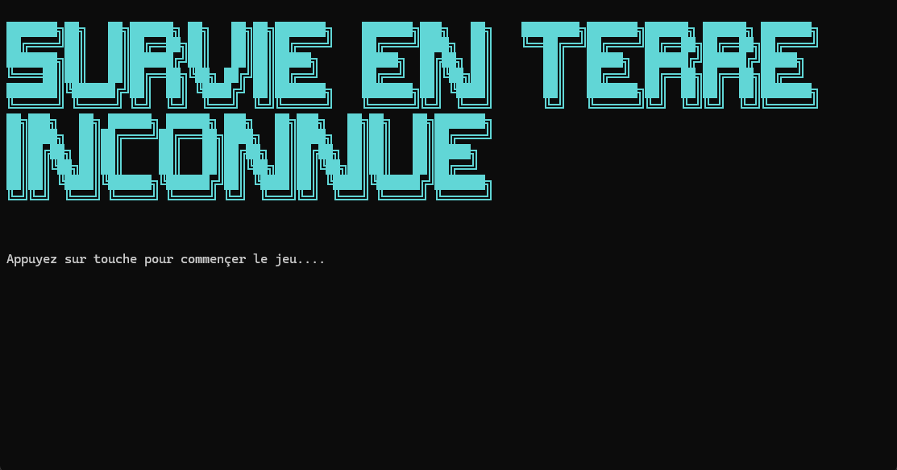

<p align="center">
  
</p>

# Survival In Unknown Territory


A survival game in C# developed for the course **420-1A6-ST – Algorithms and Structured Programming (Fall 2025)**.  
The player explores an unknown world, collects resources, crafts materials, and builds a house at the base **[0,0]** before winter arrives.

## Features
- Dynamic map generation and exploration
- Inventory system and crafting mechanics
- Save and load game functionality
- Main menu with game options and credits

## Technologies
- C# (Console Application)
- Modular programming
- Lists and multidimensional arrays
- JSON data persistence

## Tools
- Git
- Visual Studio Code 2022
  
## Getting Started
```bash
git clone https://github.com/jktchikapa/survival-in-unknown-territory-console-game-project.git
cd survival-in-unknown-territory-console-game-project
```

## How to Play

**Controls:**  
- Arrow Keys or **N/S/E/O** to move (North/South/East/West)
- Follow in-game prompts for gathering, crafting, and building

**Goal:**  
Explore the world, collect resources, and build a house at base [0,0] before winter arrives!

## Credits
Developed by Jessica Karelle and Romuald Arnaud Voufo Tsafack  
CEGEP Saint-Jean-sur-Richelieu

## License
Educational Project